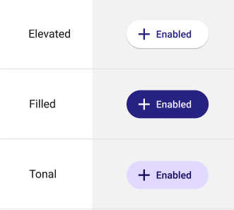

# Colors

## How to Use Colors

### Introduction

Toolkit comes preloaded with a set of semantic colors allowing project specific colors to easily be applyed to all components of the design system and their states. Each semantic color style has a predefined role to play, you can change it's HEX values to customize it for your project but you may not change it's roles in the design system without creating custom code to support that use case. E.G.: a *Filled* Button uses PrimaryColor as it’s fill color, while *Elevated* and *Tonal* Buttons use PrimaryColor to fill only their labels. So changing the HEX value of PrimaryColor would impact these buttons in (as well as almost every component in the design system). This can easily be tested and experimented with from the *Getting Started* page of the Toolkit.

### Note

Colors applied outside the provided color styles provided will not generate XAML via the plugin.

## How to apply my colors global the Uno Toolkit

### Steps

1. Make sure you have nothing selected*. Using the *Color Styles* panel on the right side of the screen, expand the color drawer.
2. Right-click on the color and choose edit style. (Or Hover and click the appearing icon)
3. From the *Properties* section choose the HEX code of the desired color. Close all open panels, by clicking the ✕ icon. You should now see your color updating throughout the document.

We recommend you do this as the first step of setting up your document but you can update and change the HEX values at any point during the project.

\* *If you have an instance of a component selected the color change will only affect that single instance and not the entire document.*

## How to apply Color to components

1. Select the component from the *Layers* panel in Figma and expand it
2. Select the layer named `◇ Template/.Templst_[component name]*`
3. Select the color to change in the *Color Selection* panel on the right hand side of your monitor
4. Right-click on the color and choose *Edit Style*
5. From the Properties section choose the HEX code of the wanted color. Close all open panels, by clicking the X.

** The top layer of a component cannot be colored.*

## How to change color of a component’s states

Component visual states are usually defined as an extra layer of their main color with varying degrees of opacity, changing the main color will impact all states for all component e.g. changing PrimaryColor would change all state colors for types of Buttons. It is not recommended to customize component states individually as the plugin may not generate proper XAML for this.

### Steps:

1. Select the component from the *Layers* panel in Figma and expand it
2. Update colors to both: `State Layer` AND `◇ Template/.Templst_[component name]`

## How do I generate a color theme?

Toolkit provides Light and Dark themes that should work for any project. If you wish to customize your theme yet do not have a predefined color theme or need help filling in the gaps for an exiting color theme, you can refer to this only tool [Material theme Builder](https://material-foundation.github.io/material-theme-builder/#/custom).

You can swap color Themes in and out of the document using the [Atlas Theme Manager Plugin](https://www.figma.com/community/plugin/893903420585768458).
