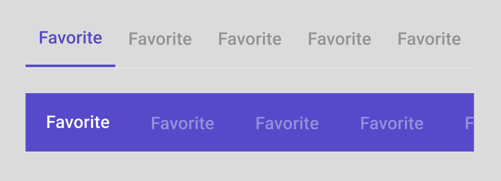

# How to use Tabs component 

## Overview

Tabs helps you organize content and data sets. Tabs component can house 1-5 TabBarItems. Tabs can either have a fixed width in which to display all it's items or it can scroll it's TabBarItems horizontally.

Tabs can be found in the *Assets* panel in the *Navigation* group of components.

## Steps

1. Drag *Tabs* component into the `Page` layer of your design (as tabs aren’t part of the scrollable content of a page);
2. Select the amount of *TabBarItems* as well as their behaviour (Fixed or Scrollable) from the *variants* panel;
3. Text and Icon options can be managed by selecting the the `◇ TabBarItem` layers to reveal their distinctive variants in the Figma Variants panel.

## Styling Tabs

Tabs can be styled as either Top Tabs or Bottom Tabs

When applying color to tabs there are 2 patterns you can use:

1. Transparent surface with PrimaryColor for the selected TabBarItem content and OnSurface @ 38% opacity for unselected TabBarItem content;
2. Filled surface with PrimaryColor, with OnPrimaryColor for the selected TabBarItem content and OnPrimaryColor @ 38% opacity for unselected TabBarItem content.

## Tab Variants

Item count: 1, 2, 3, 4, 5

Scrollable or Fixed

#### TabBarItem

Text: True or False

Icon: Top, Only, Side, None